<p align="center">
  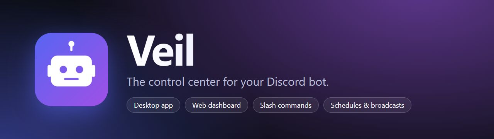
</p>

<p align="center">
  
  
  
  
  
</p>

<p align="center">
  <b>Run your bot. Watch it. Steer it.</b><br>
  Veil is a desktop app and self-hosted toolkit that gives bot owners everything they need to operate a Discord bot,<br>
  without writing admin commands, editing config files, or SSH-ing into a server.
</p>

<p align="center">
  <a href="#-quick-start">Quick start</a> ·
  <a href="#-features">Features</a> ·
  <a href="#-screenshots">Screenshots</a> ·
  <a href="#-slash-commands">Commands</a> ·
  <a href="#-security">Security</a> ·
  <a href="#-extending-veil">Extend</a> ·
  <a href="#-faq">FAQ</a>
</p>

<p align="center">
  
</p>

---

## ✨ Why Veil

- **One app, whole workflow.** Paste your token once, and Veil runs the bot, supervises it, and gives you a live dashboard, all in one window with a tray icon.
- **Every action, two ways.** Each management feature works from **Discord slash commands** *and* the **dashboard**, and both write to the same audit log.
- **Safe by default.** Token encrypted with the OS keystore, dashboard bound to localhost behind a token, strict CSP, owners can't lock themselves out, risky actions ask for confirmation.

## 🚀 Quick start

### Desktop app (recommended)

```bash
git clone https://github.com/miehlaviscool-glitch/veil.git
cd veil
npm install
npm run dist          # builds the installer + portable exe into dist/
```

You get two files in `dist/`:

| File | What it is |
| --- | --- |
| `Veil-Setup-<version>.exe` | Installer with Start menu and desktop shortcuts |
| `Veil-<version>-portable.exe` | Single file, runs without installing |

Launch it and a **first-run wizard** walks you through connecting your bot:

<p align="center">
  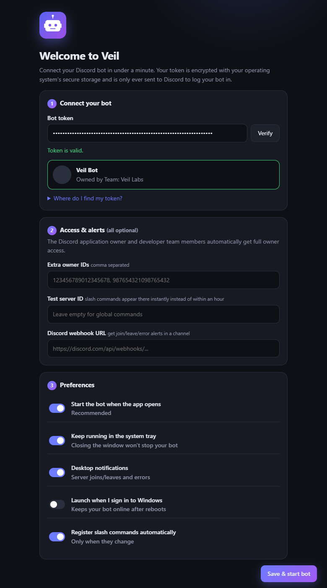
</p>

1. Paste your bot token. Veil verifies it with Discord and shows your bot's name and avatar.
2. Optionally add extra owner IDs, a test server and an alert webhook.
3. Hit **Save & start bot**. That's it.

> **No client ID, no `.env`, no intents to enable.** The Discord application owner and developer team members automatically get full owner access.
>
> The installers are unsigned, so Windows SmartScreen may warn on first run: click *More info → Run anyway*.

Want to hack on it? `npm run app` launches the desktop app from source.

### Self-hosted (headless)

Prefer a server? Run just the bot and dashboard:

```bash
npm install
cp .env.example .env     # fill in DISCORD_TOKEN and OWNER_IDS
npm start                # supervisor: restarts on crash and on /restart
```

The dashboard is at `http://127.0.0.1:3000`. If you don't set `DASHBOARD_TOKEN`, a random one is generated, printed once and saved to `data/.dashboard-token`.

## 🧰 Features

### 🖥️ Desktop experience
- **First-run wizard** with live token verification and OS-encrypted token storage (Windows DPAPI)
- **System tray** with start / stop / restart, plus **native notifications** for server joins, leaves and errors
- **Launch at sign-in**, keep-running-in-tray, single-instance lock
- **Crash supervisor**: automatic restart with exponential backoff, and it stops retrying on fatal errors like an invalid token

### 🛡️ Control
- **Three access levels**: `owner` · `manager` · `public`, enforced centrally
- **Blacklist** users and whole servers; blacklisted servers are left immediately and on re-invite
- **Maintenance mode** with a custom message
- **Runtime command control**: disable/enable commands with a reason, hot-reload files, per-command cooldowns
- **Audit log** of every action, from Discord or the dashboard

### 📣 Automate
- **Scheduled messages**: one-off or repeating (hourly / daily / weekly) to a channel or every server
- **Broadcasts** to server channels or owners' DMs, with dry-run, confirmation, rate limiting and live job progress
- **Rotating presence** with live placeholders: `{guilds}` `{users}` `{uptime}` `{ping}` `{commands}`

### 📊 Insight
- **Dashboard** with uptime, ping, memory, 14-day usage chart, top commands and most-active servers
- **Activity feed**: joins, leaves, errors and admin actions on one timeline
- **Server detail** panel with owner, size, features, usage and private notes
- **Live logs** in-app, plus `/logs`; every command error gets an **error ID**
- **Webhook alerts** to a Discord channel (optional)

### 🧳 Housekeeping
- **Backups**: one-click snapshots, restore, rotation; atomic writes; a corrupt data file is preserved, never overwritten
- **JSON export** of all your data
- **Invite builder**: Minimal / Moderator / Administrator OAuth links
- **Ctrl K command palette**, dark / light / system themes and accent colours

## 🖼️ Screenshots

<table>
  <tr>
    <td width="50%">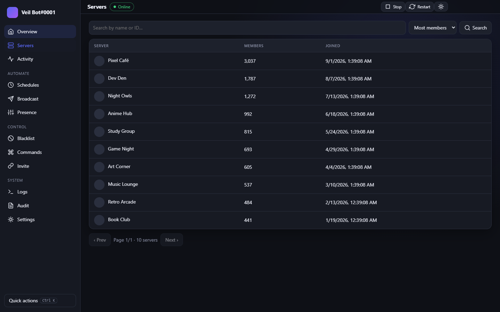<br><sub><b>Servers</b>: search, sort, inspect, leave</sub></td>
    <td width="50%">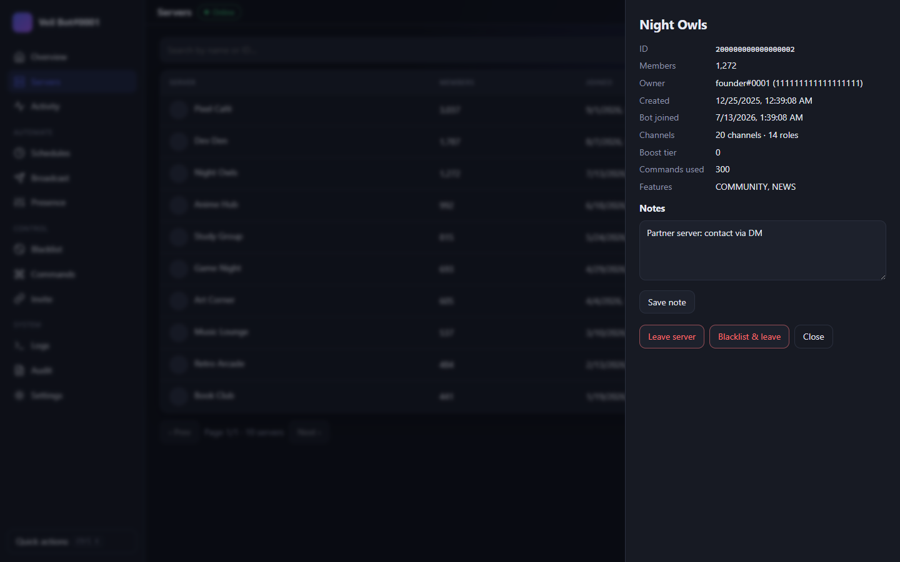<br><sub><b>Server detail</b>: stats and private notes</sub></td>
  </tr>
  <tr>
    <td>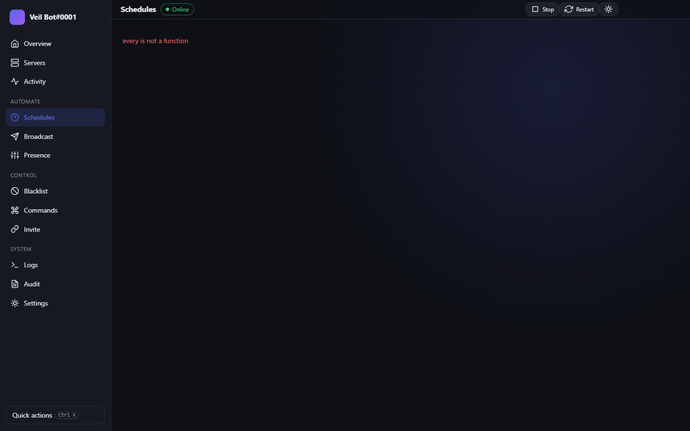<br><sub><b>Schedules</b>: one-off and repeating messages</sub></td>
    <td>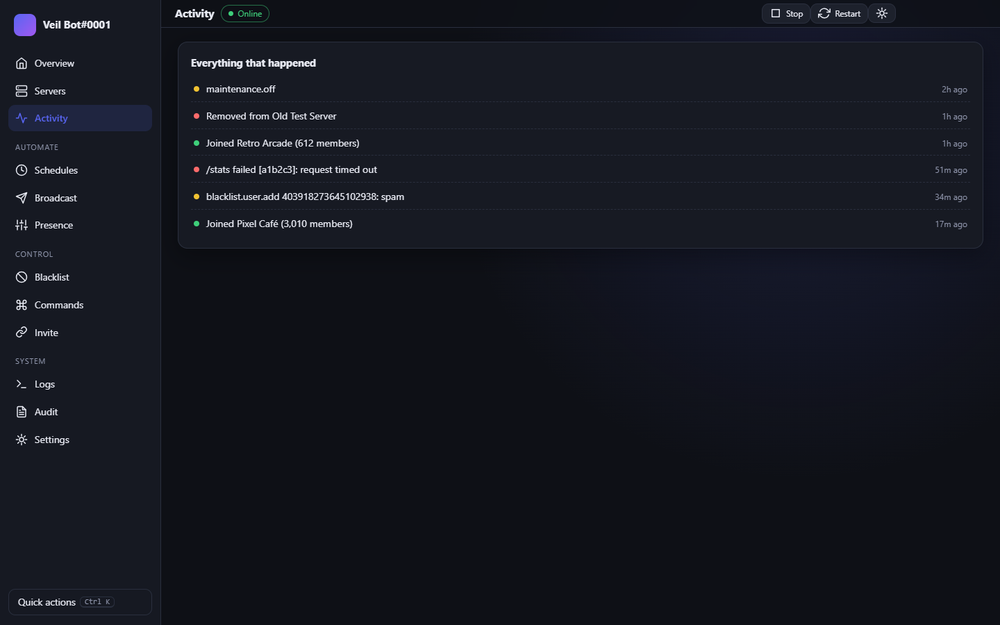<br><sub><b>Activity</b>: everything that happened</sub></td>
  </tr>
  <tr>
    <td>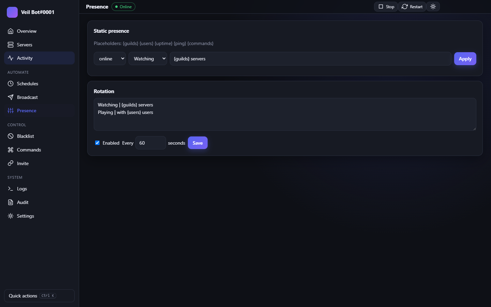<br><sub><b>Presence</b>: static status and rotation</sub></td>
    <td>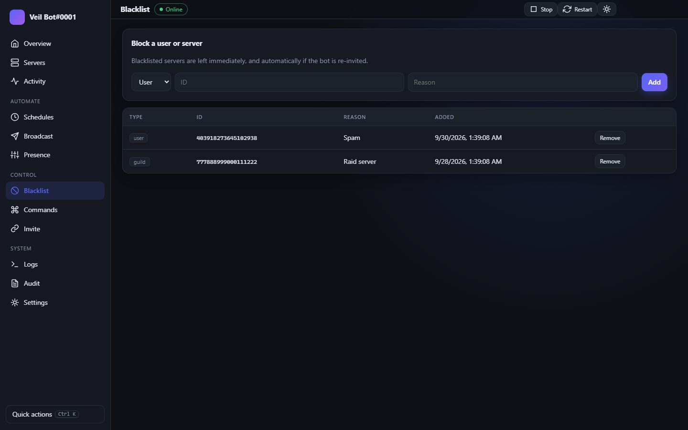<br><sub><b>Blacklist</b>: block users and servers</sub></td>
  </tr>
  <tr>
    <td>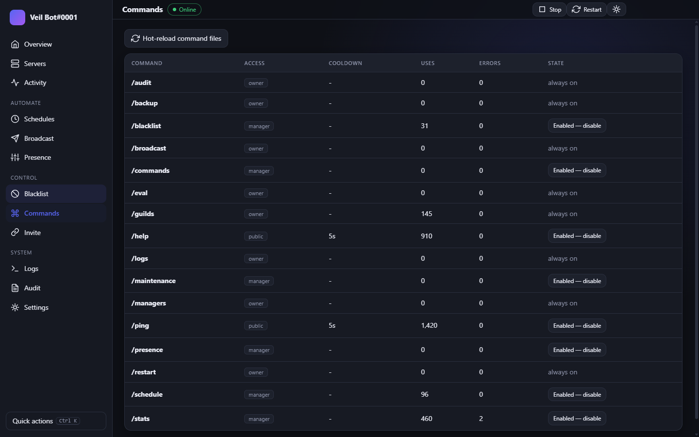<br><sub><b>Commands</b>: toggle and hot-reload at runtime</sub></td>
    <td>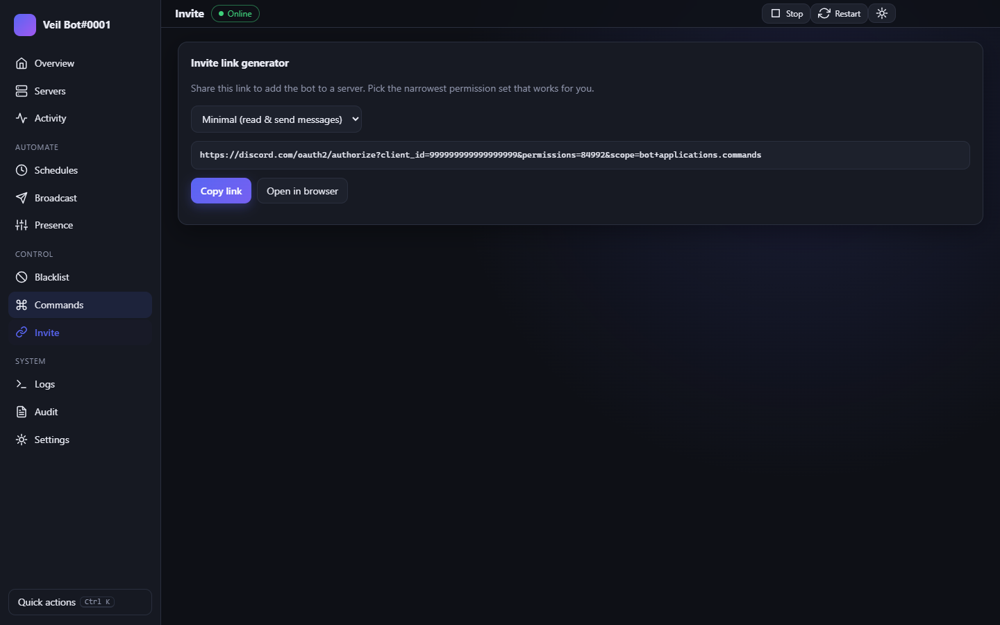<br><sub><b>Invite builder</b>: permission presets</sub></td>
  </tr>
  <tr>
    <td>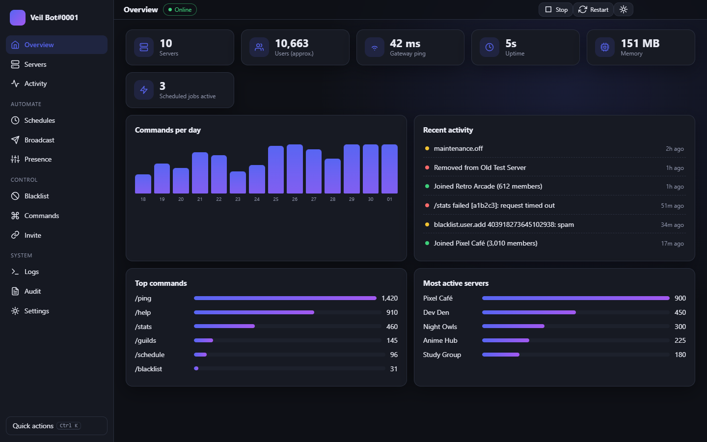<br><sub><b>Ctrl K</b>: quick actions</sub></td>
    <td>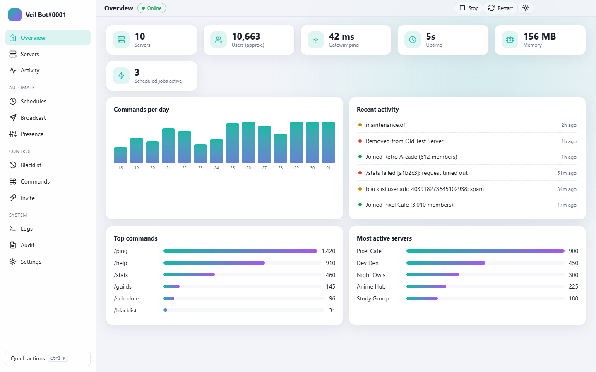<br><sub><b>Themes</b>: light mode with a teal accent</sub></td>
  </tr>
  <tr>
    <td>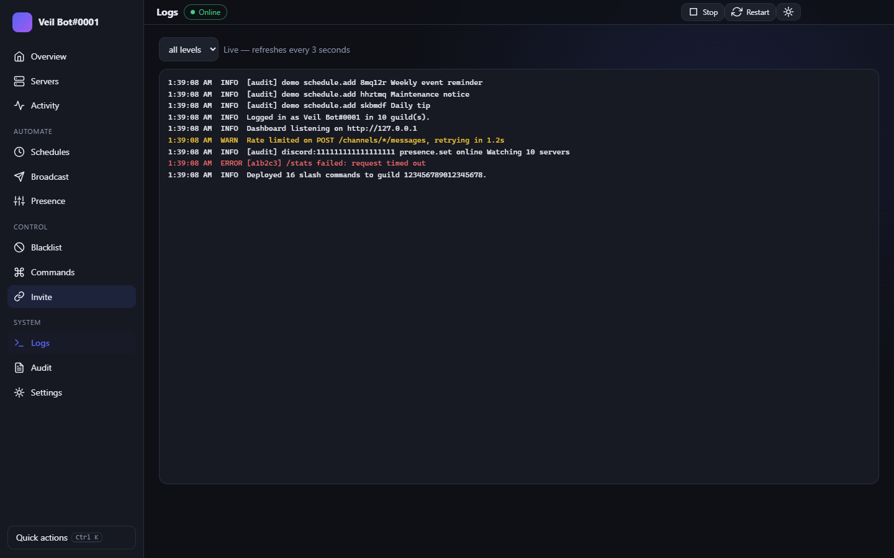<br><sub><b>Logs</b>: live, filterable</sub></td>
    <td>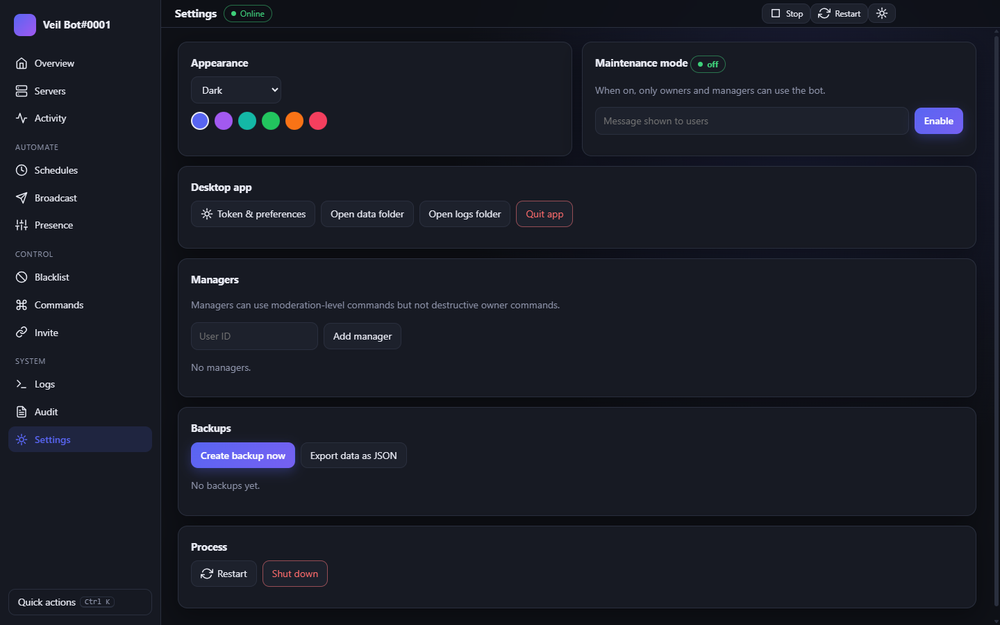<br><sub><b>Settings</b>: maintenance, managers, backups</sub></td>
  </tr>
</table>

## 💬 Slash commands

| Command | Access | What it does |
| --- | --- | --- |
| `/ping` `/help` | public | Latency; the commands available to you |
| `/stats` | manager | Live statistics and top commands |
| `/blacklist add\|remove\|list` | manager *(servers: owner)* | Block users or servers |
| `/presence set\|rotation-add\|rotation-remove\|rotation-toggle\|list` | manager | Status and rotating activities |
| `/commands list\|enable\|disable\|reload` | manager *(reload: owner)* | Runtime command control |
| `/maintenance` | manager | Toggle maintenance mode |
| `/schedule add\|list\|toggle\|run\|remove` | manager | Scheduled and repeating messages |
| `/guilds list\|info\|leave` | owner | Inspect and leave servers |
| `/broadcast` | owner | Announce to every server |
| `/managers add\|remove\|list` | owner | Delegate limited access |
| `/logs` `/audit` | owner | Recent logs and the audit trail |
| `/backup create\|list\|restore` | owner | Data backups |
| `/restart` | owner | Restart or shut down the bot |
| `/eval` | owner *(opt-in)* | Run JavaScript. **Dangerous**, off by default |

Slash commands register automatically when they change (set a test server for instant updates), or run `npm run deploy`.

## 🏗️ How it works

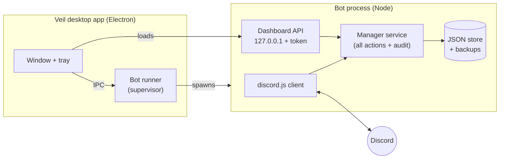

Slash commands and the dashboard both call the same `Manager` service, which is why behaviour, validation and the audit trail are identical everywhere.

## 🔒 Security

| Concern | How it's handled |
| --- | --- |
| Bot token | Encrypted with the OS keystore (DPAPI) in the desktop app; never written in plain text, never logged |
| Dashboard access | Binds to `127.0.0.1`; bearer token with constant-time comparison; 10 failed attempts per 5 minutes per IP → lockout |
| Web security | Strict CSP (no inline scripts or styles), `X-Frame-Options: DENY`, `no-store`; all UI content is set via `textContent`, never `innerHTML` |
| Desktop bridge | Context isolation + sandbox; the IPC bridge is only exposed to Veil's own pages; navigation is locked to the loopback dashboard |
| Lock-out protection | Owner commands can't be disabled; owners and managers can't be blacklisted |
| Risky actions | Confirmation for leaving servers, broadcasts, restores and restarts |
| `/eval` | Off by default; limited to IDs in `OWNER_IDS`; audited; token output redacted |

Serving the dashboard beyond localhost? Put it behind a TLS reverse proxy; never expose it over plain HTTP.

## 🧩 Extending Veil

Drop a file into `src/commands/`:

```js
const { SlashCommandBuilder } = require('discord.js');

module.exports = {
  data: new SlashCommandBuilder().setName('hello').setDescription('Say hi'),
  level: 'public',   // 'public' | 'manager' | 'owner'
  cooldown: 5,       // seconds (optional)
  async execute(interaction, ctx) {
    await interaction.reply('Hi!');
  },
};
```

Blacklists, maintenance mode, enable/disable, cooldowns, usage stats and error reporting all apply automatically. `ctx` gives you `{ client, store, logger, config, manager, notifier }`.

## ⚙️ Configuration (self-hosted)

| Variable | Default | Purpose |
| --- | --- | --- |
| `DISCORD_TOKEN` | *required* | Bot token |
| `OWNER_IDS` | | Comma-separated user IDs with owner access (the app owner/team always has it) |
| `DEV_GUILD_ID` | | Register slash commands to this server instantly |
| `AUTO_DEPLOY` | `true` | Re-register commands on startup when they changed |
| `DASHBOARD_ENABLED` / `HOST` / `PORT` | `true` / `127.0.0.1` / `3000` | Dashboard binding |
| `DASHBOARD_TOKEN` | auto-generated | Dashboard access token |
| `LOG_WEBHOOK_URL` | | Discord webhook for joins, leaves, errors and audit events |
| `ENABLE_EVAL` | `false` | Enables `/eval` (dangerous) |
| `LOG_LEVEL` | `info` | `debug` · `info` · `warn` · `error` |

The desktop app manages all of this from its settings window.

## 🗂️ Project layout

```
electron/                 desktop shell: main process, bot runner, tray, setup wizard
src/index.js              bot entry point and process safety nets
src/supervisor.js         crash/restart supervisor for headless use (npm start)
src/services/manager.js   every management action, shared by Discord and the dashboard
src/events/               ready · interactionCreate (the gatekeeper) · guildCreate/Delete
src/commands/             slash commands
src/dashboard/            Express API + the dashboard SPA
scripts/                  icon generator, command deploy, screenshot generator
test/                     node:test suite
docs/                     banner and screenshots used in this README
```

## 🛠️ Development

```bash
npm test               # 17 tests: permissions, blacklist, schedules, backups, API auth…
npm run app            # run the desktop app from source
npm run dist           # build installer + portable exe → dist/
npm run icons          # regenerate the app icons
npm run screenshots    # regenerate docs/ images from demo data
```

Tagging a release (`git tag v1.0.0 && git push --tags`) triggers a GitHub Actions workflow that builds the installers and attaches them to a draft release.

## ❓ FAQ

<details>
<summary><b>Do I need to enable privileged intents?</b></summary>
No. Veil only uses the <code>Guilds</code> intent.
</details>

<details>
<summary><b>Where is my data stored?</b></summary>
In the desktop app, under <code>%APPDATA%\Veil</code> (settings, encrypted token, <code>data/</code> and <code>logs/</code>). Self-hosted, in <code>./data</code> and <code>./logs</code>. The in-app Settings page has "open folder" buttons.
</details>

<details>
<summary><b>Can I run Veil on Linux or macOS?</b></summary>
The bot, dashboard and CLI work anywhere Node 20+ runs (see Self-hosted). The packaged installers are configured for Windows; the Electron app itself is cross-platform if you add targets to the <code>build</code> section of <code>package.json</code>.
</details>

<details>
<summary><b>How do I move to another PC?</b></summary>
Copy the <code>data</code> folder (or use Settings → Export / Backups) and re-enter the token in the setup wizard on the new machine.
</details>

<details>
<summary><b>Will it hit Discord rate limits when broadcasting?</b></summary>
Broadcasts and scheduled broadcasts are throttled to roughly one message per second and run as background jobs with progress tracking.
</details>

## 📄 License

[MIT](LICENSE)
